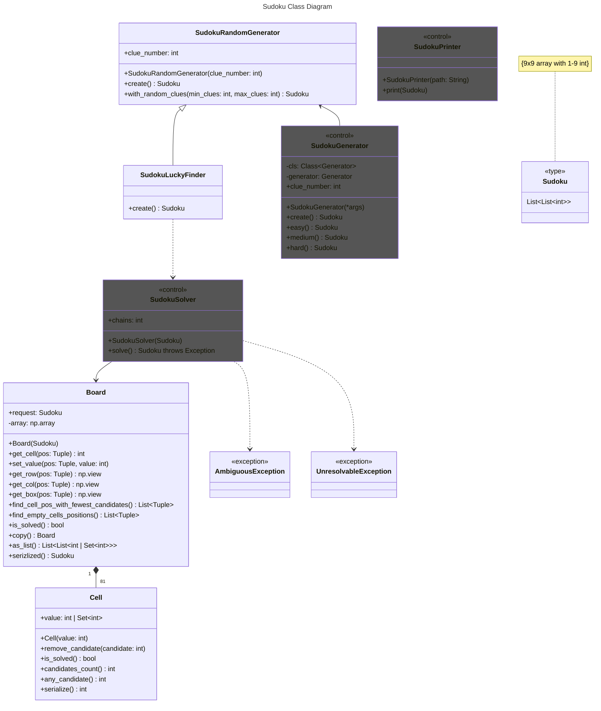

# Sudoku Solver
## Overview
The Sudoku Solver started as a basic project — an algorithm designed to solve Sudoku puzzles.
Next, it evolved into a Sudoku puzzle generator, using the solver as a validator to ensure each puzzle had a valid solution.
Finally, an HTML printer was added to generate and display the puzzles.

## Elements
### Sudoku Solver
The Sudoku Solver is the first and most important component of this project. It uses a recursive algorithm to search for all possible solutions to a given puzzle.
In Sudoku, there are three types of possible errors:
1. **Setup error** - when given puzzle are invalid by having the same numbers in one box or line.
2. **No valid solution error** - when during solvig there is no valid candidate for one or more cells.
3. **Non-unique solution error** - this is sudoku assumption that valid sudoku must have only one valid solution.
Because of these potential errors, the solver also functions as a validator, recursively examining all possible solutions not only to find a valid one but also to ensure that it is the *only* one.

The Sudoku Solver works closely with the Board class. 
The **Board** uses a NumPy array to store values represented by the **Cell** class, 
which can hold either an integer (for solved values) or a set of integers (for candidate values).

### Sudoku Generator
The Sudoku Generator is based on a random value generator (a simple “dummy” generator), but it validates each randomly chosen value step by step, narrowing down the possible candidates for the remaining cells.  
Completely random generation is highly inefficient, and even this approach is not efficient enough.  
To improve performance, the base **RandomGenerator** class is extended by the **SudokuLuckyFinder** class. LuckyFinder repeatedly attempts to generate valid Sudoku puzzles in multiple iterations, increasing the chances of finding a valid solution.
The efficiency and effectiveness of this approach are measured by the **AssertPossibility** class.  
The final component of the generator is the **SudokuGenerator** class, which acts as a simple decorator for SudokuLuckyFinder. This design allows the generator to be easily replaced or extended in the future with different generation strategies.

### Sudoku Printer
The **Printer** component outputs Sudoku puzzles to an HTML file. It uses the **Jinja** templating language to generate the HTML structure.
If no path is specified, an output folder is automatically created in the current script’s directory to store the generated files.

## Class structure

Classes: SudokuGenerator, SudokuSolver and SudokuPrinter are considered to be endpoint classes.

## Generator Performance
Below is a table with example results obtain in 1000 attempts in relation to clue value:

| Clues              |  20 |  21 |  22 |  23 |  24 |  25 |  26 |  27 |  28 |  29 |  30 |  31 |  32 |  33 |  34 |   35 |   36 |   37 |   38 |   39 |   40 |
|--------------------|----:|----:|----:|----:|----:|----:|----:|----:|----:|----:|----:|----:|----:|----:|----:|-----:|-----:|-----:|-----:|-----:|-----:|
| Valid results      |   0 |   0 |   0 |   0 |   0 |   1 |   3 |   4 |   2 |   5 |   4 |   0 |   1 |   1 |   2 |    1 |    0 |    0 |    0 |    0 |    0 |
| Ambiguous results  | 776 | 661 | 564 | 504 | 399 | 273 | 190 | 131 |  83 |  38 |  18 |  10 |   3 |   3 |   3 |    0 |    0 |    0 |    0 |    0 |    0 |
| Unsolvable results | 224 | 339 | 436 | 496 | 601 | 726 | 807 | 865 | 915 | 957 | 978 | 990 | 996 | 996 | 999 | 1000 | 1000 | 1000 | 1000 | 1000 | 1000 |

What can be observed is that valid random Sudoku puzzles tend to appear when the number of clues is between 25 and 35.
- With fewer clues, the generator often produces ambiguous puzzles (puzzles with multiple valid solutions). It is known that the minimum number of clues for a valid Sudoku puzzle is 17, but in this generator, the effective lower limit is slightly higher.
- On the other end, unsolvable puzzles start to dominate as the clue count increases beyond this range. This happens even though each subsequent number is chosen only from valid candidates.

Despite these limitations, the generator performs quite well, because typical Sudoku puzzles fall within the following clue ranges:
- easy: 32-30
- medium: 30-28
- hard: 28-26
- super hard: 17-26

The only range that remains effectively out of reach is the super hard category. 
Effectively because it is technically possible to generate puzzles with fewer clues by increasing the number of iterations, but this comes at the cost of significantly longer generation times.

## Dependencies
- **Numpy** - used for managing the 9×9 Sudoku grid within the Board class. It simplifies operations such as extracting rows, columns, and boxes.
- **jinja2** - used by SudokuPrinter to generate sudoku puzzles output in html format.  

## Future development

- Implement more sophisticated sudoku generator that dose not rely on simple random function.

## Test
To run test execute:

`python -m unittest discover`

The **test coverage** is above 90%.
It can be examine by evaluating:

```bash
 coverage run -m unittest discover
 ```  

```bash 
coverage html
```

Finally, open `htmlcov/index.html` in your browser to view the coverage report.

## Use
The demo.py file in the main package demonstrates how to use the **SudokuGenerator**, **SudokuSolver**, and **SudokuPrinter** classes, along with brief descriptions of their functionality.
