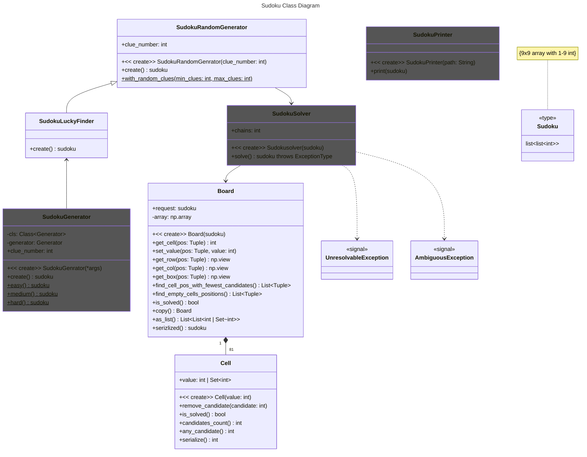

## Overview

## 

## Results

Random generating result in 1000 attempts in relation to clue value.

| Clues              |  20 |  21 |  22 |  23 |  24 |  25 |  26 |  27 |  28 |  29 |  30 |  31 |  32 |  33 |  34 |   35 |   36 |   37 |   38 |   39 |   40 |
|--------------------|----:|----:|----:|----:|----:|----:|----:|----:|----:|----:|----:|----:|----:|----:|----:|-----:|-----:|-----:|-----:|-----:|-----:|
| Valid results      |   0 |   0 |   0 |   0 |   0 |   1 |   3 |   4 |   2 |   5 |   4 |   0 |   1 |   1 |   2 |    1 |    0 |    0 |    0 |    0 |    0 |
| Ambiguous results  | 776 | 661 | 564 | 504 | 399 | 273 | 190 | 131 |  83 |  38 |  18 |  10 |   3 |   3 |   3 |    0 |    0 |    0 |    0 |    0 |    0 |
| Unsolvable results | 224 | 339 | 436 | 496 | 601 | 726 | 807 | 865 | 915 | 957 | 978 | 990 | 996 | 996 | 999 | 1000 | 1000 | 1000 | 1000 | 1000 | 1000 |

This number are example ones, gavered in same random passes. What it can be observed is that valid radndom sudoku puzzles arer created in boudaries of 25 to 35 clues. Lower values produce a sugnificant number of ambigeniues results. It is known that lowest valid number of clues is 17. So, in my generator it stopes slightly higher.  
On the other end unresolved puzzles come into play. It is even so, obvol after choosing random value all cells are validated to remove candidates from particulara row, column and box. And next choosed number is picked only from valid ones.  
Nevertheless it is works preaty nice, because typicaly sudoku puzzles are considerd to be in such boundaries:
- easy (32-30)
- medium (30-28)
- hard (28-26)
- super hard (17-26)

Only last group is effectivelly unreachable. Efectivelly becauce it is always posible to increace number of itterations, but this also increase amount of time.

## Classes 

Classes: SudokuGenerator, SudokuSolver and SudokuPrinter are considered to be endpoint classes.

